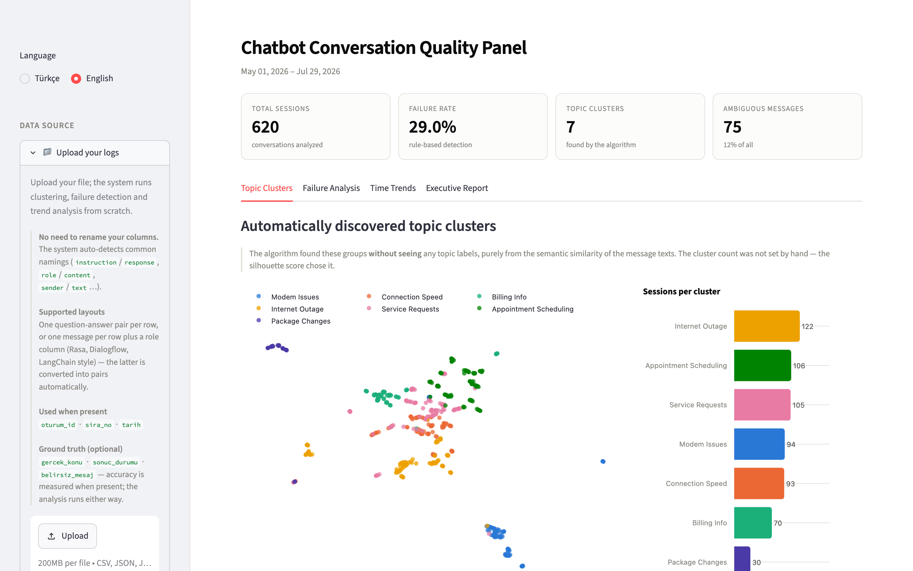
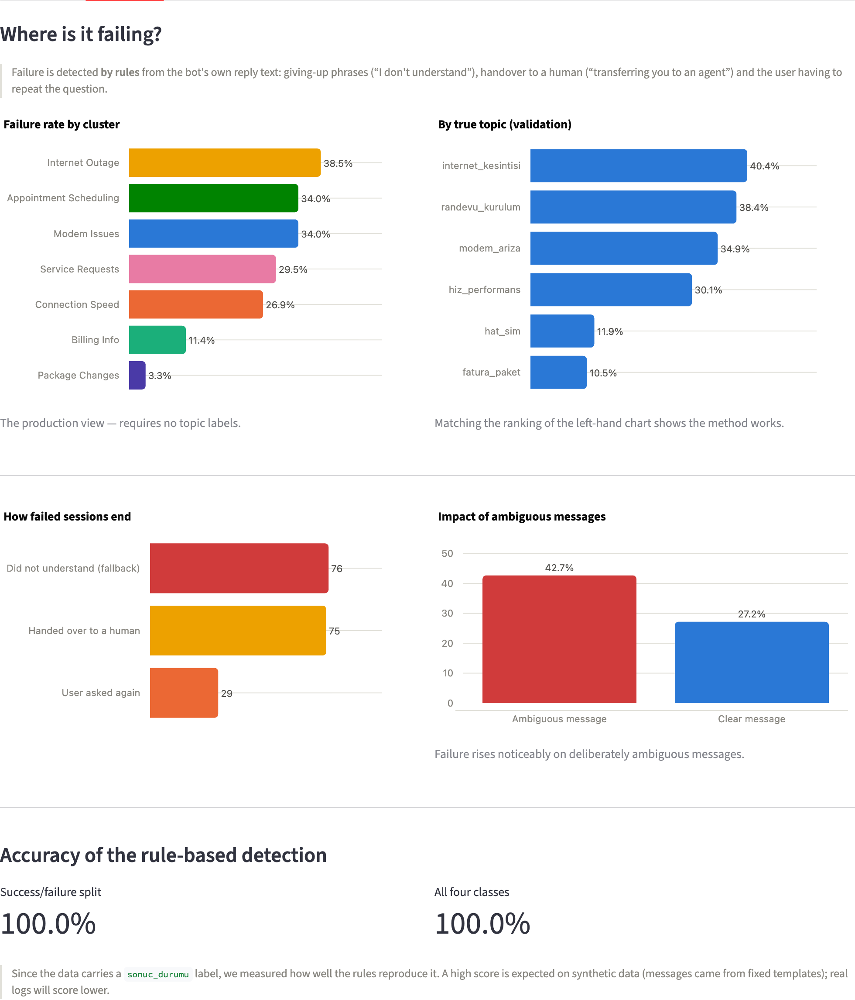
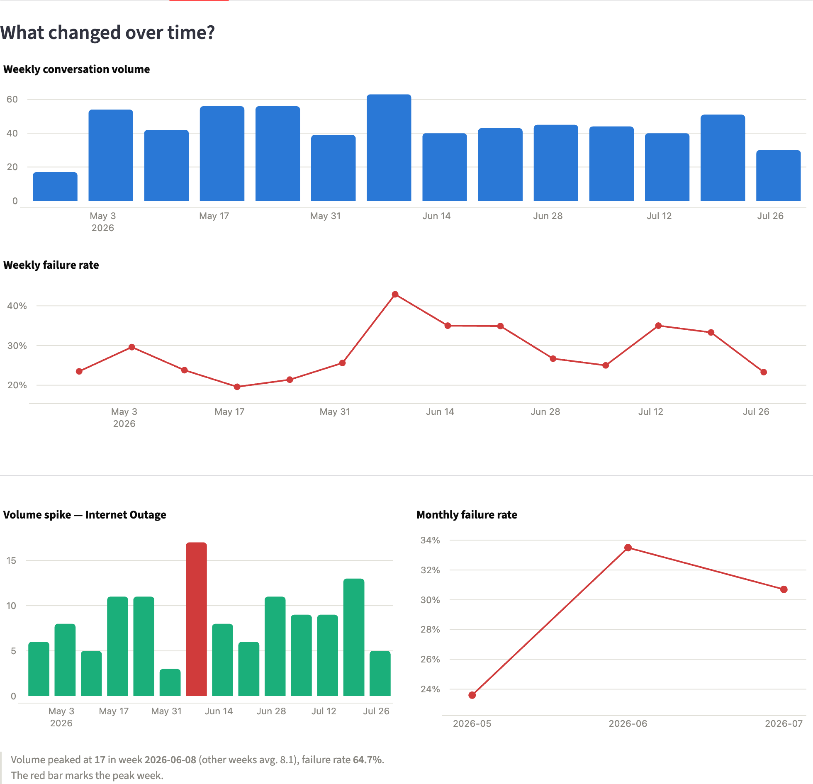
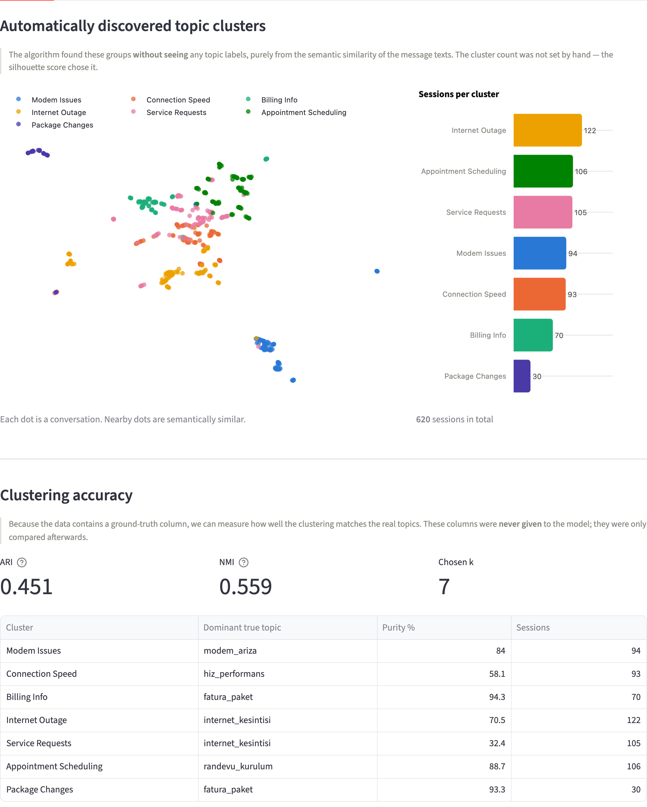
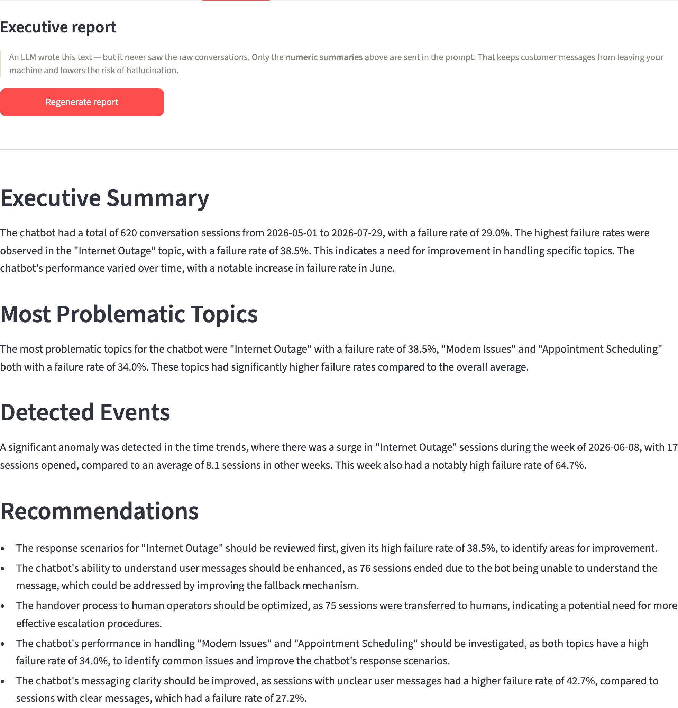
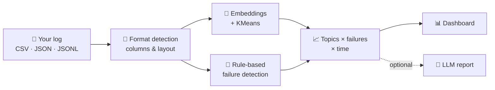

<div align="center">

# 📊 Chatbot Quality Analyzer

### Find out where your chatbot fails — without labeling a single conversation.

Drop in your chatbot logs. Get the topics people talk about, which ones go wrong,
what changed over time, and a management-ready report.
**Runs 100% on your own machine.**

[](https://github.com/ismailmelikic/chatbot-quality-analyzer/actions/workflows/tests.yml)


[](LICENSE)

[Quick start](#-quick-start) •
[Features](#-what-you-get) •
[How it works](#-how-it-works) •
[Your data](#-your-data-stays-yours) •
[Formats](#-bring-any-log-format)



</div>

---

## ✨ What you get

<table>
<tr>
<td width="50%" valign="top">

### 🧭 Topics, discovered automatically
No topic list, no labeling. Messages are grouped by **meaning** with
multilingual sentence embeddings; the number of topics is chosen by the
data itself (silhouette score).

</td>
<td width="50%" valign="top">

### 🚨 Failures, detected from the reply text
*"I don't understand"*, *"let me transfer you to an agent"*, the user asking
the same thing twice — found by language-aware rules, per topic.

</td>
</tr>
<tr>
<td valign="top">

### 📈 Trends that tell a story
Weekly volume and failure rate, automatic **volume-spike** detection,
month-over-month changes — the week your bot broke stands out in red.

</td>
<td valign="top">

### 📝 A report your manager will read
One click turns the numbers into a short executive report. Every
recommendation must cite a number from your data — no generic advice.

</td>
</tr>
</table>

---

## 🚀 Quick start

> [!NOTE]
> You need **[Python 3.12 or newer](https://www.python.org/downloads/)**. That's it.

**1. Download** — green **Code** button → **Download ZIP** (or `git clone`).

**2. Start**

| | |
|---|---|
| 🍎 **macOS** | Double-click **`start.command`** <sub>(first time: right-click → Open)</sub> |
| 🪟 **Windows** | Double-click **`start.bat`** <sub>(tick *"Add python.exe to PATH"* when installing Python)</sub> |
| 🐧 **Linux** | `bash start.command` |

**3. Analyze** — the dashboard opens at `http://localhost:8501`. Upload your
log in the sidebar and press **Run analysis**.

The first start sets everything up by itself (a few minutes, once). The first
analysis downloads the embedding model
([`paraphrase-multilingual-MiniLM-L12-v2`](https://huggingface.co/sentence-transformers/paraphrase-multilingual-MiniLM-L12-v2),
~470 MB, once) — after that it works offline.

> [!TIP]
> No logs at hand? Upload **`ornek_musteri_loglari.csv`** from the project
> folder — a synthetic telecom support log with 620 conversations.

<details>
<summary><b>Manual setup</b></summary>

```bash
python3 -m venv .venv
```

```bash
./.venv/bin/python -m pip install -r requirements.txt
```

```bash
./.venv/bin/python -m streamlit run dashboard.py
```

On Windows use `.venv\Scripts\python` instead of `./.venv/bin/python`.
</details>

---

## 🖼️ A closer look

<table>
<tr>
<td width="50%"><br><b>Failure analysis</b> — failure rate per topic and how failed conversations end</td>
<td width="50%"><br><b>Time trends</b> — weekly volume, failure rate and the detected spike</td>
</tr>
<tr>
<td width="50%"><br><b>Topic map</b> — every dot is a conversation, colored by discovered topic</td>
<td width="50%"><br><b>Executive report</b> — written by an LLM, grounded in your numbers</td>
</tr>
</table>

---

## 🔍 How it works



1. **Format detection** — column names are matched automatically; logs with
   one message per row are paired into question/answer turns.
2. **Topic discovery** — the first message of each conversation is embedded
   and clustered. No labels are ever given to the model.
3. **Failure detection** — `kurallar.py` reads the bot's reply:

   | Signal | Example |
   |---|---|
   | **Fallback** | *"I don't understand"*, *"could you rephrase?"*, *"anlayamadım"* |
   | **Hand-over to a human** | a hand-over verb **and** a human target in the same reply — *"transferring you to a human agent"* |
   | **Repeated question** | a fallback after the first turn |

   A verb alone isn't enough: *"I'm redirecting you to our offers"* is not a failure.
4. **Trends** — weekly and monthly aggregates, plus the biggest volume spike.
5. **Report** *(optional)* — the aggregated numbers go to an LLM of your choice.

> [!WARNING]
> **Failure rules are language-specific** (English and Turkish included). If a
> log matches none of them, the dashboard **tells you** instead of reporting a
> reassuring but false *"0% failure"*. To support your bot's wording or another
> language, extend the pattern lists in `kurallar.py`.

---

## 🔒 Your data stays yours

- 🏠 **Everything runs locally.** The dashboard listens on `localhost` only —
  not even other devices on your Wi-Fi can open it.
- 🙅 **Nothing is collected.** No account, no telemetry, no usage statistics.
- 🔑 **API keys are never written to disk** — they live in your browser session
  or an environment variable.
- 🤖 **The LLM is optional.** Clustering, failure detection and trends work
  without it. If you use it, data goes **only** to the provider you pick, with
  your own key:
  - *naming topics* sends up to 10 example user messages per topic,
  - *the report* sends aggregate numbers and topic names — no messages.

> [!TIP]
> **Want zero network traffic?** Install [Ollama](https://ollama.com), run
> `ollama pull llama3.1`, and pick **Local / Custom (Ollama, vLLM, on-prem)** in
> the LLM settings. The pre-filled address `http://localhost:11434/v1` is
> Ollama's default; no key needed. Nothing leaves your computer.

---

## 📥 Bring any log format

**You don't need to edit your file.** CSV, JSON and JSONL are accepted, in
either layout:

- **One row per turn** — user message and bot reply side by side.
- **One row per message** with a role column — the layout written by Rasa,
  Dialogflow, LangChain, OpenAI and similar tools.

<details>
<summary><b>Recognized column names</b></summary>

| Meaning | Recognized names |
|---|---|
| User message | `user_message`, `query`, `question`, `prompt`, `input`, `instruction`, `kullanici_mesaji`… |
| Bot reply | `response`, `answer`, `reply`, `bot_response`, `output`, `completion`, `chatbot_cevabi`… |
| Conversation | `conversation_id`, `session_id`, `dialog_id`, `chat_id`, `thread_id`, `oturum_id`… |
| Turn | `turn`, `turn_index`, `sequence`, `message_index`, `sira_no`… |
| Date | `date`, `timestamp`, `created_at`, `datetime`, `tarih`… |
| Role | `role`, `sender`, `speaker`, `author`, `is_bot`, `inbound`… — values like `user`/`bot`, `customer`/`agent`, `true`/`false` |

Anything still unrecognized? The dashboard asks which column is which.
Full list: `KOLON_IPUCLARI` in `pipeline.py`.
</details>

<details>
<summary><b>Optional columns</b></summary>

| Column | If missing |
|---|---|
| Conversation ID | every row is its own conversation |
| Turn | rows keep their file order within a conversation |
| Date | the *Time Trends* tab is hidden |

If your data has labels, the tool also grades itself against them:
`gercek_konu` (true topic → ARI/NMI), `sonuc_durumu` (true outcome → rule
accuracy), `belirsiz_mesaj` (ambiguous message, `yes`/`no`).
</details>

---

## 🔑 LLM settings

Sidebar → **LLM settings → Provider and model**: Hugging Face, NVIDIA NIM,
OpenAI, or any OpenAI-compatible local server. Keys can also come from
`HF_TOKEN`, `NVIDIA_API_KEY`, `OPENAI_API_KEY` or `LLM_API_KEY`.

Free model catalogs change often, so no model name is hard-coded —
**Auto-find a working model** tries candidates and keeps the first one that
answers.

> [!CAUTION]
> **Avoid "reasoning" models** (GLM, MiMo, Nemotron-3, gpt-oss, `*-R1`, QwQ).
> Their thinking phase eats the token budget and the report comes back empty.
> Plain *instruct* models work well — e.g. `meta-llama/Llama-3.3-70B-Instruct`.

---

## 📊 Does it work?

The sample data ships with true topic labels, so the clustering can be graded:

| Method | ARI | NMI |
|---|---:|---:|
| TF-IDF, words (1–2 grams) | 0.02 | 0.19 |
| TF-IDF, characters (3–5 grams) | 0.19 | 0.37 |
| **Embeddings + KMeans** | **0.451** | **0.559** |

Upload `telekom_chatbot_loglari.csv` to reproduce the embedding result — the
accuracy section appears in the dashboard. The failure rules reproduce the
sample's outcome labels **100%** (expected for template-generated data; real
logs will score lower). <sub>TF-IDF rows were measured during development; that
script is not in the repository.</sub>

---

## 🧪 Development

```bash
./.venv/bin/python -m pip install -r requirements-dev.txt
```

```bash
./.venv/bin/python -m pytest
```

51 tests, a few seconds, no model download — the end-to-end test uses stand-in
embeddings. CI runs them on Linux, macOS and Windows.

```
├── dashboard.py        Streamlit dashboard
├── pipeline.py         format detection + the full analysis
├── kurallar.py         rule-based failure detection (EN + TR)
├── llm.py              LLM providers, report, topic naming
├── diller.py           UI texts (EN + TR)
├── start.command       launcher — macOS / Linux
├── start.bat           launcher — Windows
├── tests/              pytest suite
└── *.csv               synthetic sample data
```

<details>
<summary><b>Troubleshooting</b></summary>

| Problem | Fix |
|---|---|
| macOS: double-click does nothing | `chmod +x start.command` in Terminal |
| macOS: "cannot be opened" | right-click the file → **Open** → **Open** |
| "Python 3.12 or newer is required" | install Python from python.org, start again |
| Setup failed halfway | delete the `.venv` folder, start again |
| Report or topic names are empty | add an API key (or pick Ollama) in LLM settings |
| Port 8501 is busy | the launcher picks the next free port and prints it |
</details>

---

<div align="center">

**[MIT License](LICENSE)** — use it, change it, share it.

If this helped you, a ⭐ on GitHub is appreciated.

</div>
